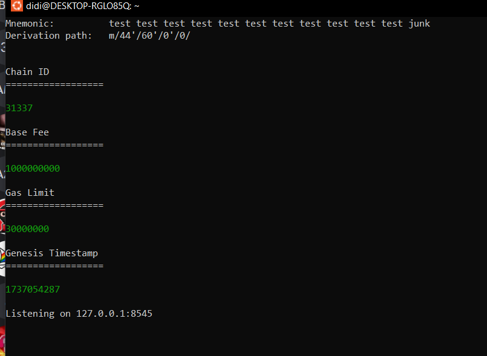
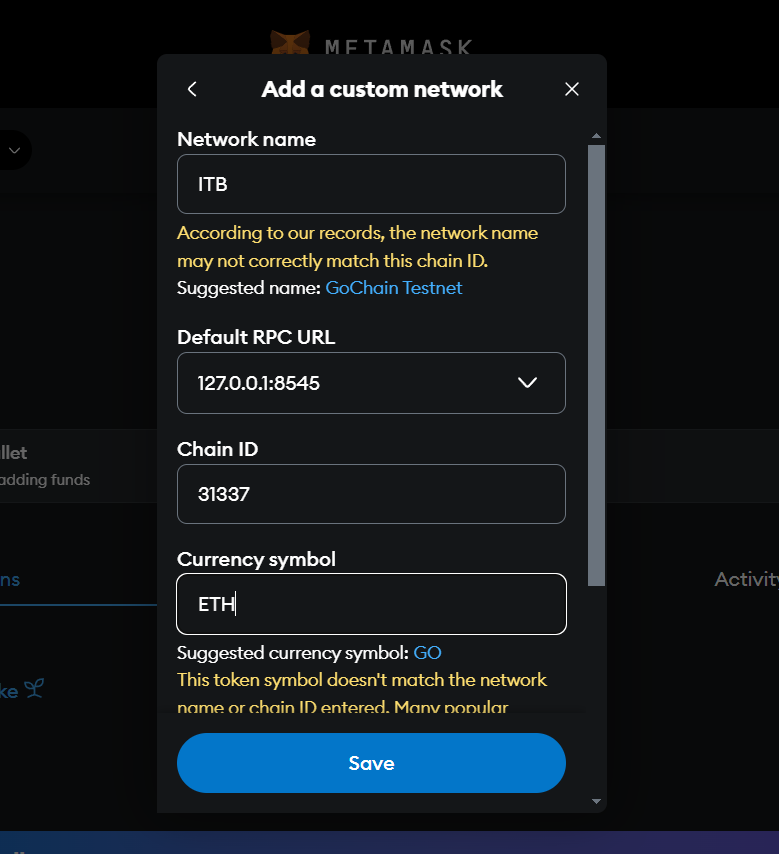

# ITB - Blockchain Bridge Project

## Instrucțiuni pentru Configurare

Acest document detaliază pașii necesari pentru configurarea wallet-urilor Ethereum și Sui, precum și integrarea acestora în proiect.

---
## Configurare Wallet Ethereum

1. **Instalare Foundry**  
   Rulați următoarele comenzi:  
   ```bash
   curl -L https://foundry.paradigm.xyz/ | bash
   source ~/.bashrc
   foundryp```
   
2. **Rulare anvil**
  ```bash
anvil
```
Avem nevoie de chain ID pentru a seta metamask


3. **Metamask**
   In metamask adaugam un costum network.
   Setam url ul local http://127.0.0.1:8545 si punem Chain ID ul luat din pasul anterior (31337)
    

4. **Importam Private Key**
  Din anvil, luam una din Private Key-urile puse la dispozitie de ei. 
5. **Deploy Contract**
Ne folosim de deployETH.sh pentru a da deploy la contractul nostru.

```bash
./deployETH.sh <<private key from anvil>>
```

6. **Importam Token**

   Avem nevoie de adresa de la deployed to pentru a adauga token. Intram in metamask, accesam "import tokens", adaugam adresa.

7. **Adaugam Tokens**
   ```bash
   cast send --rpc-url http://127.0.0.1:8545 --private-key <priv_key_contul_anvil > <DEPLOYED_TO ADDR> "mint(address,uint256)" <RECEIVER ADDR> 7000000000000000000
   ```
   
## Configurare Wallet Sui

1. **Instalam Sui**
   ```bash
   brew install sui
   ```
   In aplicatia sui, ne creem un cont. 

2. **Pornim server**
   ```bash
   RUST_LOG="off,sui_node=info" sui start --with-faucet --force-regenesis
   ```

3. **Setam enviroment local**
   ```bash
   sui client new-env --alias local --rpc http://127.0.0.1:9000
   ```
4. **Ne mutam pe enviroment local**
   ```bash
   sui client switch --env local
   ```
   In sui: settings->network->local

5. **Importam cheia din Sui Wallet**
   ```bash
   sui keytool import "<phrase from passphrase account>" ed25519
   ```

6. **Facem contul vizibil**

```bash
sui client switch --address <address>
```

7. **Adaugam bani**
   ```bash
   sui client faucet
   ```
8. **Deploy Contract**
   ```bash
   sui client publish . --gas-budget 100000000
   ```
9. **Object changes**
    Observam ce avem in Object Changes si avem nevoie de Package ID din Published Objects si de Object ID din ObjectType:AdminCap.

10. **Adaugare Tokens**
```bash
sui client call --package <package_id> --module IBTToken --function mint --
args <AdminCap_object_id> 10000 --gas-budget 10000000
```

##Cu aceste informatii luate din walleturile de mai sus, modificam fisierele 
```bash
bridge.sh
bridgeUtils.ts
```
si adaugam adresele noastre.
   

